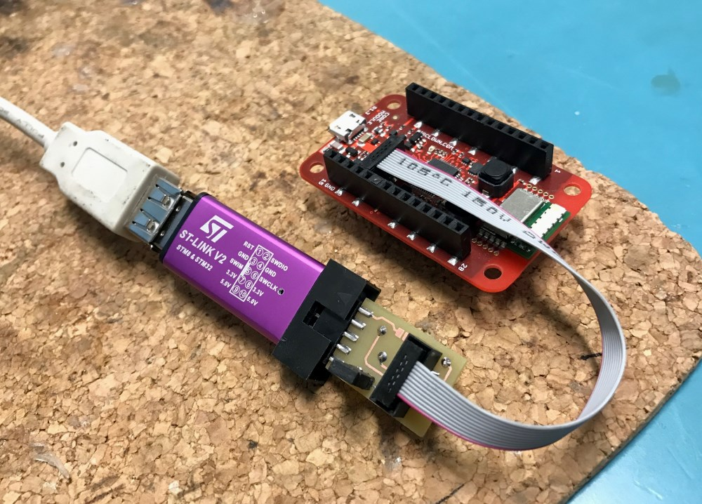

# BC-Link

*Simple adapter board between cheap Chinese ST-Link V2 clone and [**BigClown's Core Module**](https://doc.bigclown.com/core-module.html).*

## A Few Notes

- PCB is double sided but can be assembled without plated vias (friendly for homebrew PCB)
- [0.05" Connector](http://www.digikey.com/products/en?lang=en&vendor=0&WT.z_cid=ref_findchips0311_dkc_buynow&mpart=20021521-00010T1LF&cur=USD) and cable came from MS Gadgeteer
- There is one jumper for connect/disconnect Vdd

